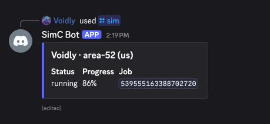
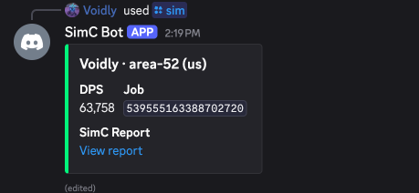

# SimC Discord bot example

Discord bot example for the [Simmit](https://simmit.com) API. Type `/sim` with a region, realm, and character; the bot submits a SimulationCraft job, polls until it finishes, and replies with the DPS and a link to the SimC HTML report.

## Setup

Requires Node 20+. You'll need:

- A Simmit secret key from [dashboard.simmit.com](https://dashboard.simmit.com).
- A Discord application from [discord.com/developers/applications](https://discord.com/developers/applications). Copy the App ID and bot token. Invite the bot with the `bot` and `applications.commands` scopes plus `Send Messages` permission.
- A Blizzard API client from [develop.battle.net/access/clients](https://develop.battle.net/access/clients). Copy the Client ID and Secret. Simmit forwards these to SimC for the armory lookup on each job and discards them after the run.

Then:

```
cp .env.example .env       # fill in the five values
npm install
npm run register           # one-time; rerun when the command shape changes
npm start
```

Set `DISCORD_DEV_GUILD_ID` for instant registration in your test server. Leave unset to register globally (propagates within an hour).

## Try it

```
/sim region:us realm:area-52 character:voidly
```

The bot builds and submits:

```
target_error=0.05
armory=us,area-52,voidly
```

The reply is a single embed that edits in place as the job progresses. Blurple while running, green on success, red on failure.

<table>
<tr>
<td></td>
<td></td>
</tr>
</table>

Failed runs link to the SimC log artifact so you can see what the lookup hit.

## How it works

The non-obvious bit is `deferReply()`. Discord requires a response within three seconds; `deferReply()` extends that to fifteen minutes. The handler calls it before any network I/O.

The rest is in [src/bot.ts](src/bot.ts): POST to `/v1/simc/jobs` with the profile text and your Battle.net credentials, poll `/status` every five seconds until terminal, fetch `/result` and pull `summary.mainActor.mean` plus the `html_report` artifact URL. Failed jobs link to `stderr_log` or `stdout_log` instead.

A typical `/sim` invocation uses around 200 credits. Running this bot for a Discord community is comfortably within the monthly allowance for verified accounts. See [the credits docs](https://dashboard.simmit.com/docs/api/credits).

## Going further

- **Custom profiles and addon exports.** Replace the armory directive with raw SimC text or accept the in-game addon export as a paste or attachment.
- **More SimC options.** Add slash command options and append them as profile lines (`calculate_scale_factors=1`, `desired_targets`, `fight_length`, `iterations`).
- **Webhooks instead of polling.** Register a webhook in your dashboard and drop the poll loop. See [the webhooks docs](https://dashboard.simmit.com/docs/api-advanced/webhooks).
- **Running 24/7.** Deploy to any always-on Node host. Discord bots are long-lived processes, not serverless workloads.

## License

MIT. See [LICENSE](LICENSE).
